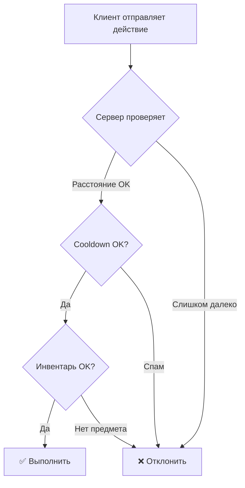

# 🛡️ Анализ Уязвимостей: main2.lua (SAFE HUB v1.16.3)

> [!CAUTION]
> Этот скрипт — **exploit-hub для Roblox**. Ниже анализируются уязвимости **со стороны разработчика игры** — как защитить свою игру от подобных скриптов, и **со стороны пользователя скрипта** — какие риски несёт запуск такого кода.

---

## 📋 Сводка Уязвимостей

| # | Уязвимость | Серьёзность | Строки |
|---|-----------|------------|--------|
| 1 | Незащищённые RemoteEvent/RemoteFunction | 🔴 Критическая | 960-962, 1091, 1171, 1185 |
| 2 | Перехват `__namecall` (метатаблицы) | 🔴 Критическая | 629-643 |
| 3 | Сканирование памяти через `getgc()` | 🔴 Критическая | 573-580, 597-601 |
| 4 | Клиентская модификация свойств Humanoid | 🟠 Высокая | 1274-1305 |
| 5 | Отключение анти-чит скриптов | 🔴 Критическая | 650-682, 984-994 |
| 6 | Манипуляция ProximityPrompt | 🟠 Высокая | 1429-1457, 1124, 1148 |
| 7 | NoClip через CanCollide | 🟠 Высокая | 1349-1361 |
| 8 | Модификация свойств Lighting | 🟡 Средняя | 878-915, 1313-1325 |
| 9 | Подмена CameraMode клиентом | 🟡 Средняя | 919-940, 1264-1271 |
| 10 | Телепортация через CFrame | 🟠 Высокая | 1141-1154 |
| 11 | Манипуляция объектами (Bring Scrap) | 🟠 Высокая | 1060-1086 |
| 12 | Чтение игровых данных (ESP/Info) | 🟡 Средняя | 1484-1527, 1530-1601 |
| 13 | GUI-маскировка под системное | 🟡 Средняя | 34, 82 |

---

## 🔴 Уязвимость 1: Незащищённые RemoteEvent / RemoteFunction

### Что делает скрипт

```lua
-- KillAura: прямой вызов серверного события StunStick (строки 960-962)
character.StunStick.Event:FireServer("S")
character.StunStick.Event:FireServer("H", rakeHRP)

-- Open SafeHouse: прямой вызов двери (строка 1091)
Workspace.Map.SafeHouse.Door.RemoteEvent:FireServer("Door")

-- Auto Fix Power: спам серверного события (строки 1171, 1185)
Workspace.Map.PowerStation.StationFolder.RemoteEvent:FireServer("StationStart")
```

### Почему это работает
Серверные RemoteEvent принимают любые данные от клиента без проверки. Нет валидации:
- расстояния до объекта
- состояния игрока (жив/мёртв, есть ли предмет в руках)
- частоты вызовов (rate-limiting)

### 🛡️ Как закрыть

**На сервере:**

```lua
-- 1. Проверка дистанции перед выполнением действия
RemoteEvent.OnServerEvent:Connect(function(player, action, target)
    local character = player.Character
    if not character or not character:FindFirstChild("HumanoidRootPart") then return end
    local humanoid = character:FindFirstChildOfClass("Humanoid")
    if not humanoid or humanoid.Health <= 0 then return end

    -- Проверка расстояния (StunStick должен быть в пределах удара)
    if action == "H" and target then
        local distance = (character.HumanoidRootPart.Position - target.Position).Magnitude
        if distance > 15 then return end -- максимальная дальность удара
    end

    -- Проверка наличия предмета
    if not character:FindFirstChild("StunStick") then return end

    -- Rate-limiting: один удар не чаще раза в 0.3 секунды
    local lastHit = player:GetAttribute("_lastHit") or 0
    if tick() - lastHit < 0.3 then return end
    player:SetAttribute("_lastHit", tick())

    -- Выполнение действия...
end)
```

```lua
-- 2. Проверка для Power Station
PowerRemoteEvent.OnServerEvent:Connect(function(player, action)
    if action ~= "StationStart" then return end

    local character = player.Character
    if not character then return end
    local hrp = character:FindFirstChild("HumanoidRootPart")
    if not hrp then return end

    -- Проверка: игрок должен быть рядом с PowerStation
    local stationPos = Workspace.Map.PowerStation:GetPivot().Position
    if (hrp.Position - stationPos).Magnitude > 25 then
        warn("[AC] " .. player.Name .. " tried to fix power remotely!")
        return
    end

    -- Rate-limiting
    local lastFix = player:GetAttribute("_lastFix") or 0
    if tick() - lastFix < 2 then return end
    player:SetAttribute("_lastFix", tick())
end)
```

```lua
-- 3. Проверка для открытия двери SafeHouse
DoorRemote.OnServerEvent:Connect(function(player, action)
    if action ~= "Door" then return end

    local character = player.Character
    if not character or not character:FindFirstChild("HumanoidRootPart") then return end

    local doorPos = Workspace.Map.SafeHouse.Door:GetPivot().Position
    if (character.HumanoidRootPart.Position - doorPos).Magnitude > 15 then
        return -- игрок слишком далеко
    end
end)
```

---

## 🔴 Уязвимость 2: Перехват `__namecall` (Metatable Hook)

### Что делает скрипт

```lua
-- Строки 629-643: подмена метатаблицы game
local metatable = getrawmetatable(game)
local originalNamecall = metatable.__namecall
setreadonly(metatable, false)
metatable.__namecall = function(self, ...)
    if noFallDamage == true then
        local args = {...}
        if tostring(self) == "FD_Event" then
            args[1] = 0; args[2] = 0  -- обнуляет урон от падения
            return self.FireServer(self, unpack(args))
        end
    end
    return originalNamecall(self, ...)
end
```

### Почему это работает
Exploit-среда (`getrawmetatable`, `setreadonly`) позволяет перехватить вызовы `:FireServer()` **до их отправки**, модифицируя аргументы. Сервер получает `0, 0` вместо реального урона.

### 🛡️ Как закрыть

```lua
-- На сервере: НЕ доверять аргументам клиента для FD_Event

-- ПЛОХО (текущий подход):
FD_Event.OnServerEvent:Connect(function(player, damage, height)
    player.Character.Humanoid:TakeDamage(damage) -- клиент контролирует урон!
end)

-- ХОРОШО: сервер сам рассчитывает урон от падения
local playerFallData = {}

game.Players.PlayerAdded:Connect(function(player)
    player.CharacterAdded:Connect(function(character)
        local hrp = character:WaitForChild("HumanoidRootPart")
        local humanoid = character:WaitForChild("Humanoid")

        local lastY = hrp.Position.Y
        local falling = false
        local peakY = hrp.Position.Y

        RunService.Heartbeat:Connect(function()
            local currentY = hrp.Position.Y

            if currentY < lastY - 0.5 then
                if not falling then
                    falling = true
                    peakY = lastY
                end
            end

            if falling and humanoid.FloorMaterial ~= Enum.Material.Air then
                local fallDistance = peakY - currentY
                if fallDistance > 20 then -- порог урона
                    local damage = (fallDistance - 20) * 2
                    humanoid:TakeDamage(math.min(damage, humanoid.MaxHealth))
                end
                falling = false
                peakY = currentY
            end

            lastY = currentY
        end)
    end)
end)
```

> [!IMPORTANT]
> **Главный принцип**: сервер НИКОГДА не должен принимать значение урона от клиента. Все расчёты урона должны выполняться серверным кодом.

---

## 🔴 Уязвимость 3: Сканирование памяти через `getgc()`

### Что делает скрипт

```lua
-- Строки 573-580: изменение таблицы стамины прямо в памяти
for _, value in pairs(getgc(true)) do
    if type(value) == "table" and rawget(value, "STAMINA_REGEN") then
        value.STAMINA_REGEN = 100
        value.STAMINA_TAKE = 0
        value.stamina = 100
    end
end

-- Строки 597-601: аналогично для ночного видения
for _, value in pairs(getgc(true)) do
    if type(value) == "table" and rawget(value, "NVG_TAKE") then
        value.NVG_TAKE = 0
        value.NVG_REGEN = 100
    end
end
```

### Почему это работает
`getgc(true)` возвращает все объекты в Lua garbage collector, позволяя найти и изменить любую таблицу по известным ключам. Эксплойт модифицирует конфигурационные таблицы стамины/NVG прямо в памяти клиента.

### 🛡️ Как закрыть

```lua
-- 1. Серверная валидация стамины
-- Храните стамину НА СЕРВЕРЕ, а не только на клиенте

-- Серверный скрипт:
local PlayerStamina = {}

game.Players.PlayerAdded:Connect(function(player)
    PlayerStamina[player.UserId] = {
        stamina = 100,
        lastAction = tick()
    }
end)

-- При действиях, требующих стамины (бег, прыжок):
SprintRemote.OnServerEvent:Connect(function(player, isSprinting)
    local data = PlayerStamina[player.UserId]
    if not data then return end

    if isSprinting then
        -- Сервер сам рассчитывает расход
        local elapsed = tick() - data.lastAction
        data.stamina = math.max(0, data.stamina - elapsed * STAMINA_DRAIN_RATE)

        if data.stamina <= 0 then
            -- Принудительно остановить бег
            StopSprintRemote:FireClient(player)
        end
    else
        -- Восстановление стамины
        local elapsed = tick() - data.lastAction
        data.stamina = math.min(100, data.stamina + elapsed * STAMINA_REGEN_RATE)
    end
    data.lastAction = tick()
end)
```

```lua
-- 2. Обфускация ключей таблиц (дополнительная мера, НЕ основная)
-- Вместо очевидных имён используйте случайные идентификаторы:
local CONFIG = {
    ["a7x9k2"] = 100,   -- было STAMINA_REGEN
    ["m3p1q8"] = 10,    -- было STAMINA_TAKE
    ["j5w2r6"] = 0.8,   -- было JUMP_COOLDOWN
}
```

> [!WARNING]
> Обфускация — это **дополнительная мера**, а не решение. Основная защита — серверная валидация. Обфускацию можно обойти, но она затруднит работу эксплойтеров.

---

## 🟠 Уязвимость 4: Клиентская модификация Humanoid (Speed, Jump)

### Что делает скрипт

```lua
-- Строки 1274-1305: каждый кадр принудительно меняет WalkSpeed/JumpPower
if speedEnabled then
    humanoid.WalkSpeed = speedValue -- до 40
end
if jumpEnabled then
    humanoid.JumpPower = jumpValue -- до 80
end
```

### 🛡️ Как закрыть

```lua
-- Серверный скрипт: проверка скорости по позиции каждые N секунд
local MAX_SPEED = 20 -- ваше максимальное WalkSpeed + запас
local CHECK_INTERVAL = 1

task.spawn(function()
    while true do
        task.wait(CHECK_INTERVAL)
        for _, player in pairs(game.Players:GetPlayers()) do
            local character = player.Character
            if character then
                local hrp = character:FindFirstChild("HumanoidRootPart")
                local humanoid = character:FindFirstChildOfClass("Humanoid")
                if hrp and humanoid then
                    -- Фиксируем позицию
                    local lastPos = player:GetAttribute("_lastPos")
                    local currentPos = hrp.Position

                    if lastPos then
                        local distance = (currentPos - lastPos).Magnitude
                        local maxAllowed = MAX_SPEED * CHECK_INTERVAL * 1.5
                        if distance > maxAllowed then
                            -- Телепортируем обратно или кикаем
                            hrp.CFrame = CFrame.new(lastPos)
                            warn("[AC] Speed hack: " .. player.Name)
                        end
                    end
                    player:SetAttribute("_lastPos", currentPos)
                end
            end
        end
    end
end)

-- Дополнительно: принудительно устанавливать WalkSpeed с сервера
game.Players.PlayerAdded:Connect(function(player)
    player.CharacterAdded:Connect(function(character)
        local humanoid = character:WaitForChild("Humanoid")
        -- Сервер контролирует скорость
        humanoid:GetPropertyChangedSignal("WalkSpeed"):Connect(function()
            if humanoid.WalkSpeed > MAX_SPEED then
                humanoid.WalkSpeed = 16 -- дефолт
                warn("[AC] " .. player.Name .. " modified WalkSpeed")
            end
        end)
    end)
end)
```

---

## 🔴 Уязвимость 5: Отключение анти-чит скриптов

### Что делает скрипт

```lua
-- Строки 650-682: фоновый поток каждые 3 секунды отключает защиту
for _, s in pairs(LocalPlayer.Character:GetDescendants()) do
    if s:IsA("LocalScript") then
        local n = s.Name:lower()
        if n:match("bug") or n:match("clip") or n:match("cheat")
        or n:match("exploit") or n:match("valid") or n:match("check")
        or n:match("detect") or n:match("anti") then
            s.Disabled = true  -- отключает ваш анти-чит!
        end
    end
end
```

### 🛡️ Как закрыть

```lua
-- 1. НЕ называйте анти-чит скрипты очевидными именами!
-- ПЛОХО: "AntiCheat", "ExploitDetector", "ClipCheck"
-- ХОРОШО: "GameController", "PlayerManager", "CoreSystem"

-- 2. Серверная проверка работоспособности клиентского анти-чита (heartbeat)
-- Клиентский скрипт (ваш "анти-чит"):
local HeartbeatRemote = ReplicatedStorage:WaitForChild("ACHeartbeat")
task.spawn(function()
    while true do
        task.wait(5)
        HeartbeatRemote:FireServer(tick())
    end
end)

-- Серверный скрипт:
local lastHeartbeat = {}

ACHeartbeat.OnServerEvent:Connect(function(player, timestamp)
    lastHeartbeat[player.UserId] = tick()
end)

-- Проверка: если heartbeat не приходит 15+ секунд — скрипт отключён
task.spawn(function()
    while true do
        task.wait(10)
        for _, player in pairs(game.Players:GetPlayers()) do
            local last = lastHeartbeat[player.UserId]
            if last and (tick() - last) > 15 then
                player:Kick("Обнаружено нарушение целостности клиента")
            end
        end
    end
end)
```

```lua
-- 3. Не полагайтесь на клиентский анти-чит как на основное средство защиты!
-- ПРАВИЛО: клиентский анти-чит — это ДОПОЛНЕНИЕ к серверной валидации,
-- а не замена. Всё, что можно проверить на сервере — проверяйте на сервере.
```

---

## 🟠 Уязвимость 6: Манипуляция ProximityPrompt

### Что делает скрипт

```lua
-- Строки 1429-1457: обнуление HoldDuration для мгновенного открытия ящиков
prompt.HoldDuration = 0
unlockValue.Value = 100 -- меняет значение разблокировки

-- Строки 1124, 1148: принудительный вызов prompt из любой позиции
fireproximityprompt(prompt)
```

### 🛡️ Как закрыть

```lua
-- Серверный скрипт: обработка ProximityPrompt ТОЛЬКО на сервере
prompt.Triggered:Connect(function(player)
    local character = player.Character
    if not character then return end
    local hrp = character:FindFirstChild("HumanoidRootPart")
    if not hrp then return end

    -- 1. Проверка расстояния (MaxActivationDistance + запас)
    local promptPos = prompt.Parent.Position
    if (hrp.Position - promptPos).Magnitude > prompt.MaxActivationDistance + 5 then
        warn("[AC] " .. player.Name .. " triggered prompt from too far!")
        return
    end

    -- 2. Серверная проверка UnlockValue вместо клиентской
    local box = prompt.Parent.Parent
    local unlockValue = box:FindFirstChild("UnlockValue")
    if unlockValue then
        -- Значение хранится и проверяется ТОЛЬКО на сервере
        local serverUnlockData = ServerBoxData[box]
        if not serverUnlockData or serverUnlockData.unlockProgress < 100 then
            return -- ещё не разблокировано
        end
    end

    -- 3. Anti-spam: один ящик — одно открытие
    if box:GetAttribute("_opened") then return end
    box:SetAttribute("_opened", true)
end)
```

> [!IMPORTANT]
> `HoldDuration` и `UnlockValue` должны проверяться **на сервере**. Клиент может изменить любое свойство на своей стороне.

---

## 🟠 Уязвимость 7: NoClip через CanCollide

### Что делает скрипт

```lua
-- Строки 1349-1361: каждый кадр делает все части персонажа непроходимыми
for _, part in pairs(char:GetDescendants()) do
    if part:IsA("BasePart") then
        part.CanCollide = false
    end
end
```

### 🛡️ Как закрыть

```lua
-- Серверная проверка позиции: raycast от последней позиции к текущей
local function isInsideWall(position)
    local params = RaycastParams.new()
    params.FilterType = Enum.RaycastFilterType.Include
    params.FilterDescendantsInstances = {Workspace.Map} -- ваша карта

    -- Проверяем 4 луча вокруг позиции
    local offsets = {
        Vector3.new(1, 0, 0), Vector3.new(-1, 0, 0),
        Vector3.new(0, 0, 1), Vector3.new(0, 0, -1),
    }

    local wallCount = 0
    for _, offset in pairs(offsets) do
        local result = Workspace:Raycast(position, offset * 2, params)
        if result then wallCount = wallCount + 1 end
    end

    return wallCount >= 3 -- если 3+ стены рядом = внутри объекта
end

-- Проверка каждую секунду
task.spawn(function()
    while true do
        task.wait(1)
        for _, player in pairs(game.Players:GetPlayers()) do
            local hrp = player.Character
                and player.Character:FindFirstChild("HumanoidRootPart")
            if hrp and isInsideWall(hrp.Position) then
                -- Телепортировать на безопасную позицию или кикнуть
                warn("[AC] NoClip detected: " .. player.Name)
                hrp.CFrame = CFrame.new(player:GetAttribute("_lastSafePos") or Vector3.new(0, 50, 0))
            else
                player:SetAttribute("_lastSafePos", hrp and hrp.Position)
            end
        end
    end
end)
```

---

## 🟡 Уязвимость 8: Модификация Lighting (Day Mode)

### Что делает скрипт

```lua
-- Строки 878-915 и 1313-1325: принудительная смена времени суток и тумана
Lighting.ClockTime = 14
Lighting.FogEnd = 9e9
-- Также изменяет ReplicatedStorage.CurrentLightingProperties
```

### 🛡️ Как закрыть

```lua
-- Серверный скрипт: устанавливать свойства Lighting с сервера каждые N секунд
task.spawn(function()
    while true do
        task.wait(5)
        -- Принудительно восстанавливаем серверные значения
        Lighting.ClockTime = ServerTimeOfDay
        Lighting.FogEnd = ServerFogEnd
    end
end)

-- ПРИМЕЧАНИЕ: полностью предотвратить клиентскую модификацию Lighting
-- невозможно. Это визуальная уязвимость, не влияющая на геймплей напрямую.
-- Рассмотрите серверные механики ограничения видимости:
-- — наложение тумана через Humanoid:GetPropertyChangedSignal (unreliable)
-- — серверный рендеринг ключевых объектов (не показывать объекты далёким игрокам)
```

---

## 🟠 Уязвимость 10: Телепортация через CFrame

### Что делает скрипт

```lua
-- Строки 1141-1154: мгновенная телепортация к рычагу и обратно
hrp.CFrame = leverPart.CFrame + Vector3.new(0, -3, 0)
-- ... (нажимает рычаг) ...
hrp.CFrame = lastpos -- возвращает обратно
```

### 🛡️ Как закрыть

```lua
-- Серверная проверка скорости перемещения (описана в Уязвимости 4)
-- + дополнительная проверка "телепортаций":

local function checkTeleport(player, oldPos, newPos)
    local distance = (newPos - oldPos).Magnitude
    local maxPossible = 100 -- максимально допустимое перемещение за 1 проверку

    if distance > maxPossible then
        -- Это телепортация
        warn("[AC] Teleport: " .. player.Name .. " moved " .. distance .. " studs")
        return true
    end
    return false
end
```

---

## 🟠 Уязвимость 11: Манипуляция объектами (Bring Scrap)

### Что делает скрипт

```lua
-- Строки 1060-1086: перемещает все скрапы к игроку
item.CFrame = targetCF  -- телепортирует предмет к себе
item.Anchored = false
```

### 🛡️ Как закрыть

```lua
-- Серверная сетевая владельность (Network Ownership)
-- Ключевые предметы вроде скрапа должны иметь SERVER ownership

for _, scrap in pairs(Workspace.Filter.ScrapSpawns:GetDescendants()) do
    if scrap:IsA("BasePart") then
        scrap:SetNetworkOwner(nil) -- сервер владеет объектом
        scrap.Anchored = true      -- нельзя двигать с клиента
    end
end

-- Для подбора предмета используйте ProximityPrompt + серверную проверку
-- вместо физического перемещения объекта клиентом
```

> [!IMPORTANT]
> Если сервер владеет объектом (`SetNetworkOwner(nil)`), клиент **не сможет** изменить его `CFrame` или `Anchored`. Это самая эффективная защита от Bring/Teleport эксплойтов.

---

## 🟡 Уязвимость 12: Чтение игровых данных (ESP & Info)

### Что делает скрипт

```lua
-- Чтение Rake target, Timer, Blood Hour status, Power Level
-- из ReplicatedStorage (строки 1484-1527)
rake.TargetVal.Value              -- кого преследует Rake
ReplicatedStorage.Night.Value     -- день/ночь
ReplicatedStorage.Timer.Value     -- таймер
ReplicatedStorage.PowerLevel.Value -- уровень энергии
```

### 🛡️ Как закрыть

```lua
-- Не храните чувствительные данные в ReplicatedStorage!

-- ПЛОХО: данные видны ВСЕМ клиентам
ReplicatedStorage.PowerValues.PowerLevel.Value = 750

-- ХОРОШО: отправляйте данные только тем, кому нужно
PowerUpdateRemote:FireClient(specificPlayer, powerLevel)

-- Для Rake Target: НИКОГДА не раскрывайте цель всем клиентам
-- Цель Rake — серверная информация. Если клиенту нужна анимация
-- "Rake бежит к вам", отправляйте "TargetIsYou" конкретному игроку,
-- а не имя цели всем.
```

---

## 🟡 Уязвимость 13: GUI-маскировка

### Что делает скрипт

```lua
-- Строка 34: GUI маскируется под системный элемент Roblox
local GUI_NAME = "RbxAnalyticsUI"
```

### 🛡️ Как закрыть

```lua
-- На стороне серверного анти-чита нельзя проверить CoreGui напрямую.
-- Рекомендуется: серверная валидация действий (все предыдущие пункты)
-- делает GUI скрипта бесполезным, даже если он не обнаружен.
```

---

## 📐 Архитектурные Рекомендации

### Принцип «Никогда не доверяй клиенту»



### Чеклист серверной безопасности

- [ ] **Каждый RemoteEvent** имеет серверную проверку расстояния
- [ ] **Каждый RemoteEvent** имеет rate-limiting
- [ ] **Урон** рассчитывается только сервером
- [ ] **Стамина/ресурсы** контролируются сервером
- [ ] **Network Ownership** на ценных объектах установлен на сервер
- [ ] **Чувствительные данные** НЕ хранятся в ReplicatedStorage
- [ ] **Анти-чит скрипты** имеют неочевидные имена
- [ ] **Heartbeat-проверка** работы клиентских скриптов
- [ ] **Серверная проверка** позиции для обнаружения NoClip/Teleport
- [ ] **ProximityPrompt** валидируется серверным кодом

---

## ⚠️ Итоговые Рекомендации

> [!CAUTION]
> **Для разработчиков игры**: этот скрипт эксплуатирует исключительно **отсутствие серверной валидации**. Все перечисленные уязвимости устраняются полностью, если внедрить правило: **«Сервер никогда не доверяет данным от клиента — всегда проверяет и пересчитывает»**.

> [!TIP]
> **Приоритет закрытия уязвимостей** (по влиянию на геймплей):
> 1. 🔴 RemoteEvent для атаки (KillAura) — даёт боевое преимущество
> 2. 🔴 Fall Damage bypass — делает игрока бессмертным при падении
> 3. 🔴 Отключение анти-чита — открывает доступ ко всему остальному
> 4. 🟠 NoClip + Teleport — ломает карту и зоны доступа
> 5. 🟠 Bring Scrap / Insta-Open — экономический дисбаланс
> 6. 🟡 ESP / Info Reading — информационное преимущество
> 7. 🟡 Visual (Day Mode, FOV) — минимальное влияние на баланс
